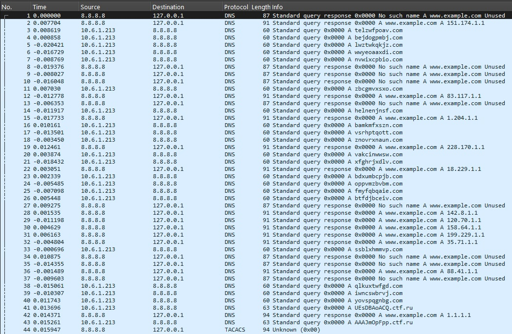
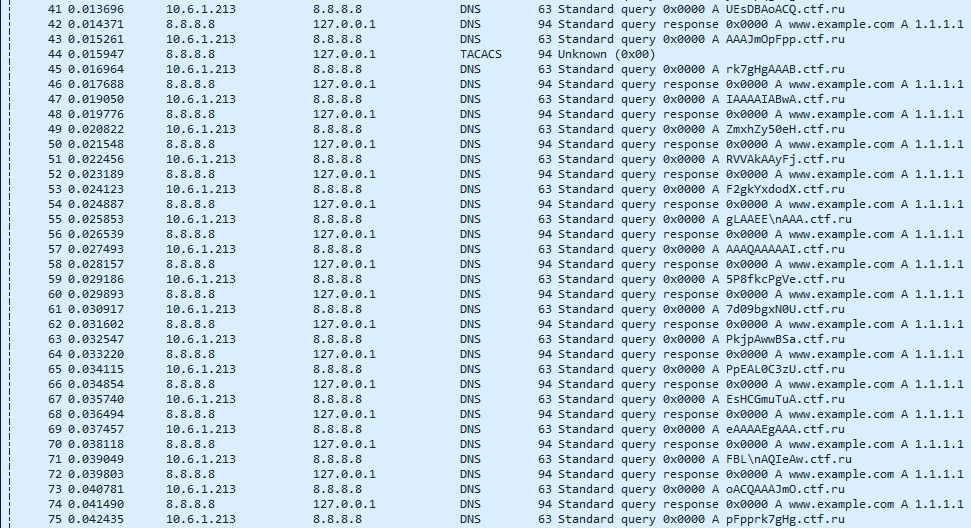
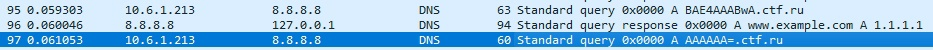
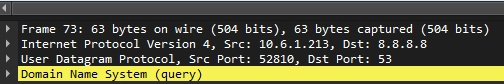
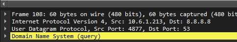
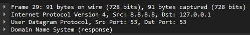
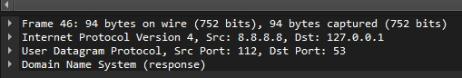
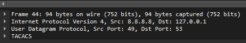

Имеется .pcap файл с определенным фрагментом сетевого трафика:



Все записи выглядят достаточно странно и расположены в хаотичном порядке, мы должны проанализировать трафик и заметить записи следующего вида:



В отличие от других доменов (например, gfdtjdlpeg.com), эти выглядят как закодированный набор символов (различия в регистре, иные символы, не входящие в английский алфавит). Это наталкивает на мысль о том, что эти символы можно раскодировать каким-либо образом и получить что-то ценное. К тому же, если внимательно изучить все записи, можно заметить, что записи подобного вида расположены по порядку (от первой к последней), ведь последняя содержит знак "=":



Увидев знак, мы понимаем, что здесь, скорее всего, используется base64 и записи расположены сверху вниз по порядку, после чего при помощи скрипта извлекаем закодированные части и декодируем их (можно извлекать вручную в условный .txt файл):
```
from scapy.all import *
import base64

DOMAIN = "ctf.ru"
OUTPUT = "flag.zip"

def extract_parts(pcap):
    parts = []
    for pkt in rdpcap(pcap):
        if DNSQR in pkt and f".{DOMAIN}" in str(pkt[DNSQR].qname):
            data = pkt[DNSQR].qname.decode().split(f".{DOMAIN}")[0]
            parts.append(data)
    return "".join(parts)

with open(OUTPUT, "wb") as f:
    f.write(base64.b64decode(extract_parts("capture.pcap")))
```
Теперь у нас есть архив, при попытке его разархивировать обнаруживаем, что он защищен паролем. Возвращаемся к .pcap файлу и продолжаем анализировать записи. Если внимательно все изучить, то можно обнаружить, что у всех записей строки "Src Port" в UDP отличаются значительно, например:







У большинства записей он будет пятизначным/четырехзначным числом, либо же равен 53, лишь у малой части будут отличия. Нам нужно обратить внимание на двузначные/трехзначные source-порты, так как они являются ascii кодами:





Далее мы либо вручную сопоставляем коды с символами по таблице ascii, либо используем скрипт для преобразования:
```
codes = input("Codes: ").split()
for c in codes:
    print(chr(int(c)), end="")
```
После преобразования получаем набор символов, которые собираются в пароль "z1p_d0m@in". Получаем флаг из архива при помощи команды:
```
unzip -P z1p_d0m@in flag.zip
```
