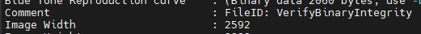
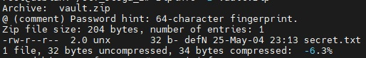

Первым делом открываем изображение `plant.jpg`, чтобы проверить, нет ли в нём видимых аномалий. На первый взгляд, это обычный снимок растения, похожего на папоротник. Никаких явных подсказок не видно, поэтому попробуем проверить метаданные файла командой:
```
exiftool plant.jpg
```
Наблюдаем достаточно большое количество информации, но нас интересует комментарий:



Подсказка намекает на crc32 изображения, поэтому далее нам необходимо вычислить ее, делаем это при помощи скрипта:
```
import zlib

with open("plant.jpg", "rb") as f:
    data = f.read()
    crc32 = hex(zlib.crc32(data) & 0xFFFFFFFF)
    print("CRC32 ключ:", crc32)
```

Теперь у нас есть crc32, видим файл data.bin и делаем предположение, что он зашифрован с помощью XOR (подсказка в названии таска). Напишем скрипт для расшифровки XOR с ключом `0xa3e9f715` (crc32):
```
crc_key = 0xa3e9f715
key_bytes = crc_key.to_bytes(4, "big")  

with open("data.bin", "rb") as f:
    encrypted = f.read()
    decrypted = bytes([encrypted[i] ^ key_bytes[i % 4] for i in range(len(encrypted))])
    print("Расшифрованные данные:", decrypted.decode())
```

В итоге получим запись следующего вида: `55.7522,37.6214`.
Это координаты места: широта `55.7522`, долгота `37.6214`, но пока непонятно, для чего они нужны. Теперь делаем догадку, что в информации о архиве может быть что-то ценное, проверяем при помощи zipinfo:
```
zipinfo -z vault.zip  
```

Получаем следующий вывод:



Подсказка указывает на то, что паролем является какой-то отпечаток из 64 символов, можно сделать предположение, что речь о хеше, а именно SHA-256 (64 символа). Значит, нам нужно преобразовать координаты в хеш SHA-256, для этого используем скрипт:
```
import hashlib  
coordinates = "55.7522,37.6214"  
password = hashlib.sha256(coordinates.encode()).hexdigest()  
```

Используем полученный из скрипта пароль для разархивации и получаем флаг:
```
unzip -P 7f9c4a08b17a6d7d7b7d7a7d7a7d7a7d7a7d7a7d7a7d7a7d7a7d7a7d7a vault.zip  
```
