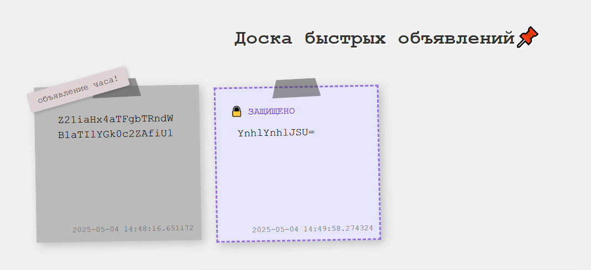
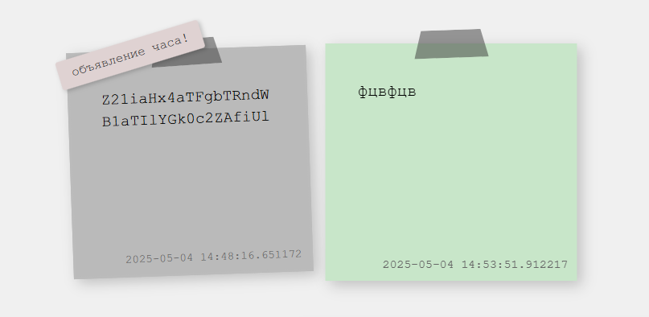
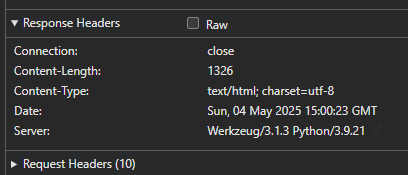
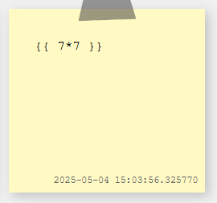
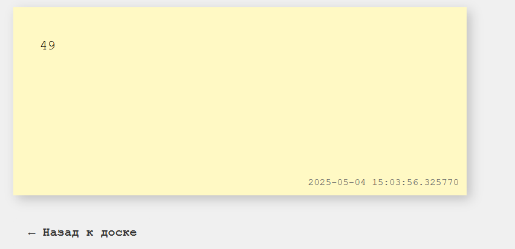
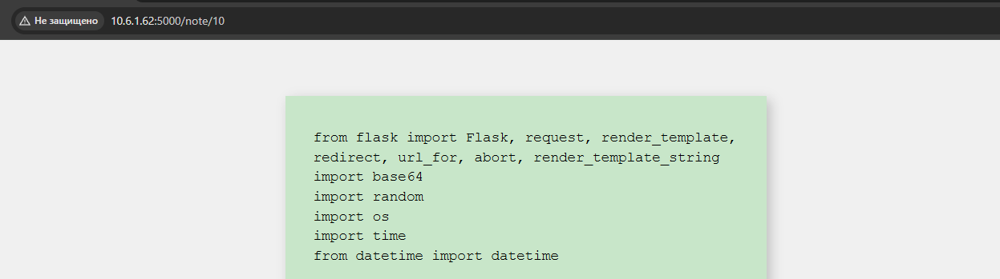
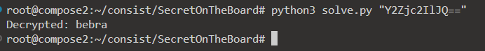
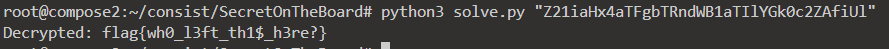

Попадаем на страницу с быстрыми объявлениями. Осматриваемся, нет почти ничего прикольного. Одно объявление, можно выкладывать свои, можно их защищать.

Пробуем че-нить выложить, ничего не происходит.

Без защиты тоже ничего особо прикольного нет, просто стикер с текстом.

Если сейчас зайти на первое объявление, то оно не будет найдено. Видимо, объявления действительно быстрые и через какое-то время удаляются. Объявление часа все также висит, но в защищенном виде.

Просматриваем заголовки/куки и все остальное. Из ответов сервера понимаем, что написано все на фласке:

Сразу бежим проверять SSTI, мало ли вдруг.

Успех! Так как суть в объявлении, а не получении рута - пробуем получить исходники и посмотреть, как защищаются объявления.

Использовать будем шаблон `{{config.__class__.__init__.__globals__['os'].popen('cat app.py').read()}}`, чтобы посмотреть исходники, а после вполне успешно их получаем:

Видим сами функции шифрования и приступаем к не самой интересной части - пишем обратные функции (все в `solve.py`).

Тестируем. Добавляем объявление с текстом "bebra" и пробуем запустить скрипт:

Снова вполне успешно. Смотрим что в главном объявлении и получаем флаг:

