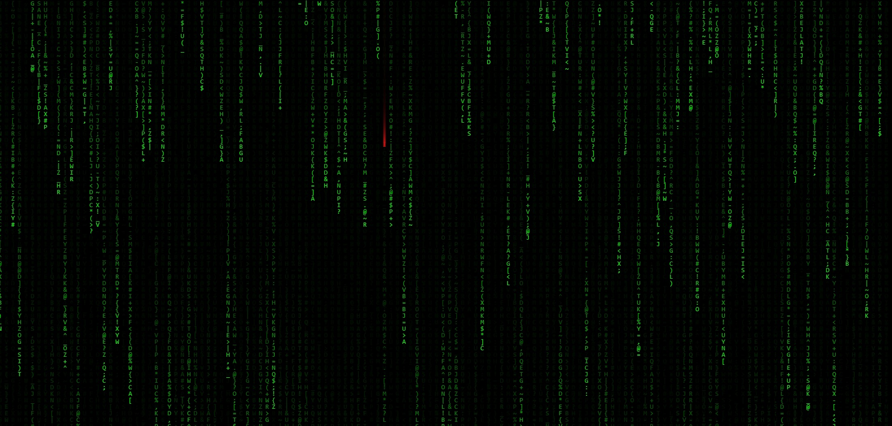
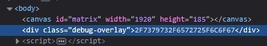
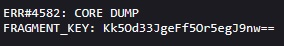
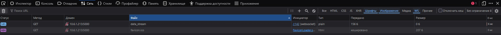
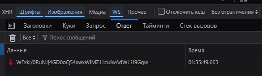
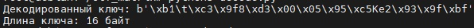
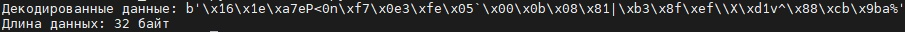

Попадаем на сайт, видим падающие символы, в том числе и какой-то красный:



После того как символ упал и занял свое место, можем видеть, что это буква "I", но пока нам это ни о чем не говорит. Подождав еще несколько секунд видим "V", потом символ ":". После начинают падать различные символы и буквы, по итогу получаем запись приблизительно следующего вида:
```
IV:Kk5Od33JgeFf5Or5
```
Это говорит нам о том, что есть какое-то шифрование, в котором используется вектор инициализации (IV), который будет первыми 16 байтами зашифрованных данных.

Теперь жмем F12 и изучаем код, смотрим вкладки на предмет странностей. В инспекторе html-кода сразу видим странную строчку:



Это hex-код, при расшифровке получим "/sys/err_log", а когда перейдем по этому пути увидим некий ключ:



Изучаем вкладки инструментов дальше, доходим до вкладки "Сеть", после чего обновляем страницу. Здесь мы увидим websocket:



Далее кликнем на него и просмотрим все вкладки, во вкладке "Ответ" через какое-то время появляется какая-то зашифрованная информация:



Ранее мы уже получили подсказку по поводу вектора инициализации, получили ключ, а теперь обладаем зашифрованными данными, сейчас нам нужно будет дешифровать их. Можно заметить, что данные и ключ закодированы в base64, поэтому сначала вручную декодируем их скриптом:
```python
import base64
encoded = "sQnDnzjTAAWVxUtlMpOfvw=="  
decoded = base64.b64decode(encoded)
print("Декодированные данные:", decoded)
print("Длина данных:", len(decoded), "байт")
```
Выводим также длину данных, чтобы попробовать определить тип шифрования. При декодировании ключа получаем 16 байт бинарных данных, с ним действий больше производить не нужно:



Декодиуруем зашифрованную информацию из websocket и получаем 32 байта зашифрованных данных:



Из ранее полученной подсказки ясно, что первые 16 байт - IV, а остальные 16 - зашифрованные данные. Все это говорит о том, что скорее всего используется AES-CBC, поскольку CBC требует паддинга данных до размера блока 16 байт и использует IV длиной 16 байт, а AES является достаточно популярным алгоритмом шифрования. 

Теперь нам нужно дополнить наш скрипт, чтобы он декодировал из base64, после чего сразу дешифровал данные с использованием ключа, это будет выглядеть следующим образом:
```python
import base64
from Crypto.Cipher import AES
from Crypto.Util.Padding import unpad

encoded_key = "Kk5Od33JgeFf5Or5egJ9nw=="
key = base64.b64decode(encoded_key)

encrypted_part = "7iPYY68SJ+18uLXDP3di6GMklWTX3/UuzD5x0IVnY7U="

try:
    data = base64.b64decode(encrypted_part)
    iv = data[:16]
    ciphertext = data[16:]
    
    cipher = AES.new(key, AES.MODE_CBC, iv)
    decrypted = unpad(cipher.decrypt(ciphertext), 16).decode()
    
    print("Decrypted part:", decrypted)

except (ValueError, base64.binascii.Error) as e:
    print("Error:", e)
```

После выполнения скрипта с подставленными данными мы получим расшифрованную часть флага, далее нужно будет расшифровать все остальные данные, полученные из websocket и собрать флаг воедино.
