# Решение:

Заходим на сайт, смотрим все страницы, проверяем исходники, ничего интересного не находим. Жмем кнопку ретро-темы - получаем запрет. Смотрим чем мы обменивались с сервером и прочие интерености в DevTools:

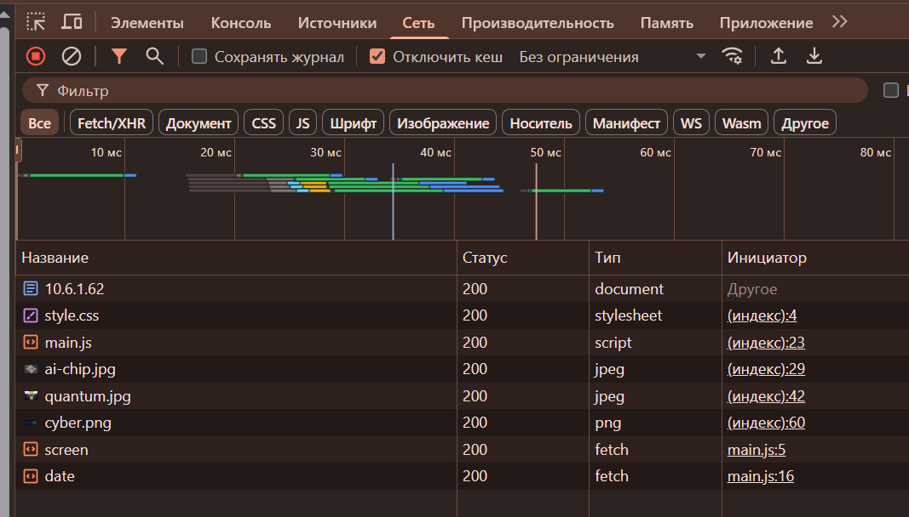

Также видим, что в `main.js` мы отправляем серверу дату и разрешение экрана. Запомним это. 

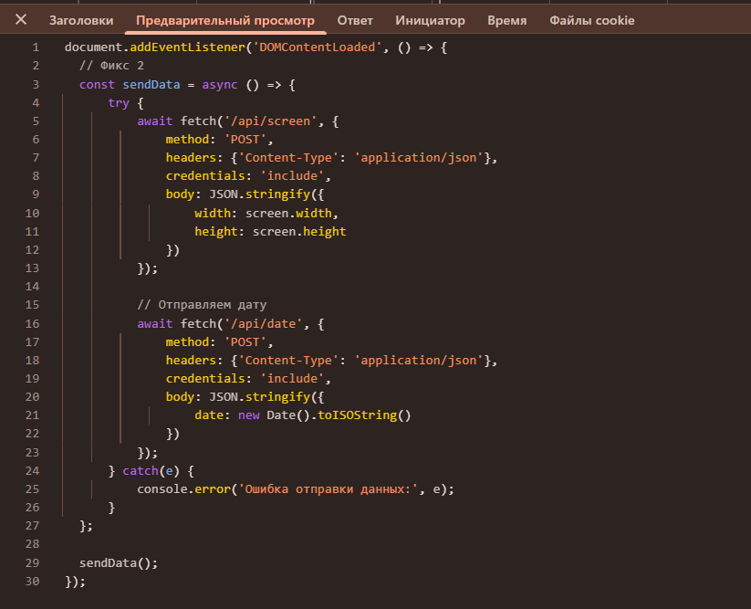

На этом моменте стоит предположить, что не пускает из-за нашего разрешения экрана или даты. Бежим в Burp Suite и пробуем поиграться с данными, которые серверу не понравились.

Видим запросы для даты и разрешения экрана:

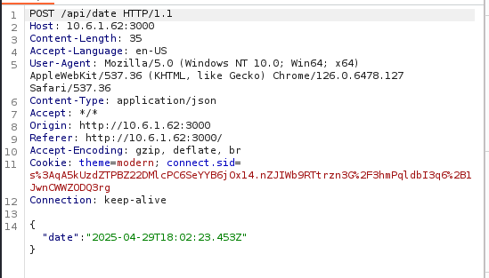
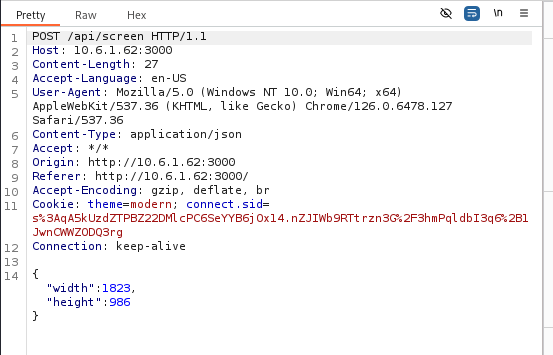

Для разрешения экрана стоит чуть-чуть погуглить. Если тема ретро, то и разрешение, судя по всему, должно быть соответствующим. Бежим смотреть статистики разрешений в примерно 2000-х годах или просто вспоминаем, кому как =). 

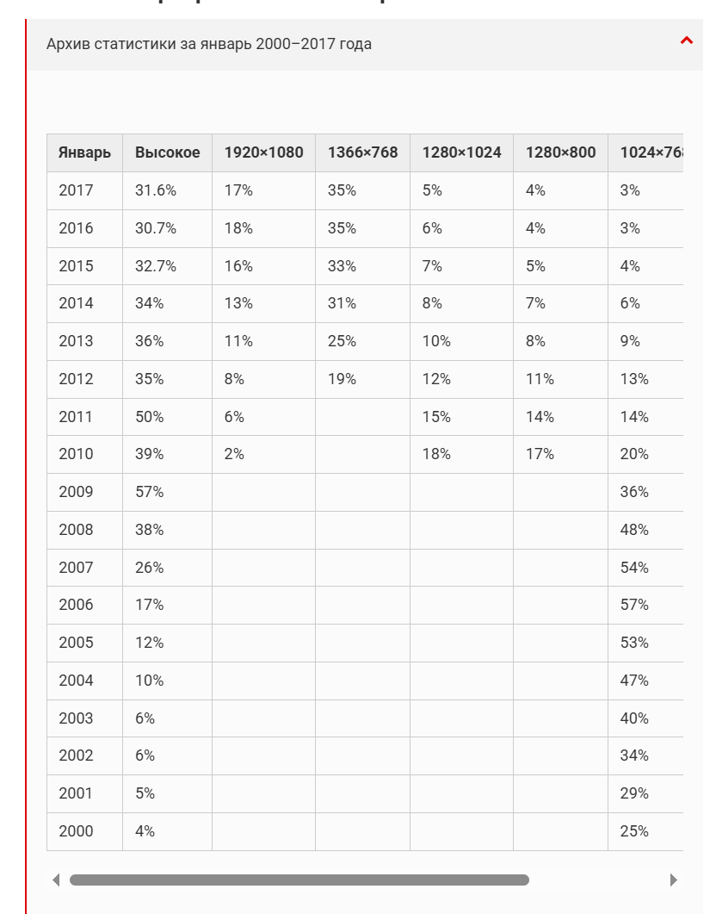

Видим что наиболее распространены в то время были 1024х768, 800x600 и ниже.

Для даты чуть усилим внимательность. Единственное что на сайте упоминается, это то, что они выросли из обычного портала, который был создан в 2000 году. 

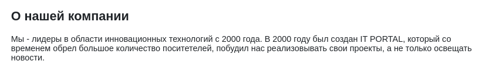

Пробуем выставить дату периода 2000х и подходящее разрешение, больше вариантов не остается.

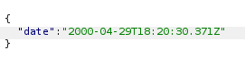

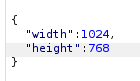

Все равно нам не верят:

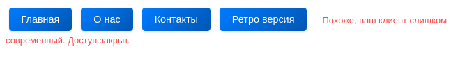

Если подумать, то сильно глубоко сервер в параметры системы залезть не может и тщательно проверить нас на "олдовость" тоже. Единственное, что может подойти - это что-то с бразуером. Для начала пробуем менять `User-Agent` в наших запросах, предварительно поискав какие-нибудь, которые использовались в древних браузерах.

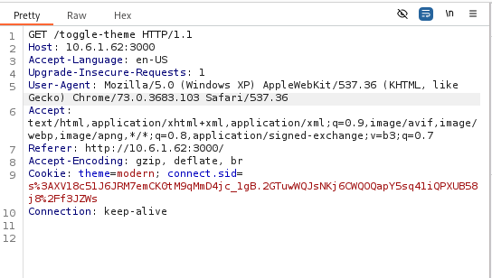

После нескольких попыток все таки получаем олдовую версию портала. Бегаем по страницам, снова ничего интересного кроме ссылки на FTP.

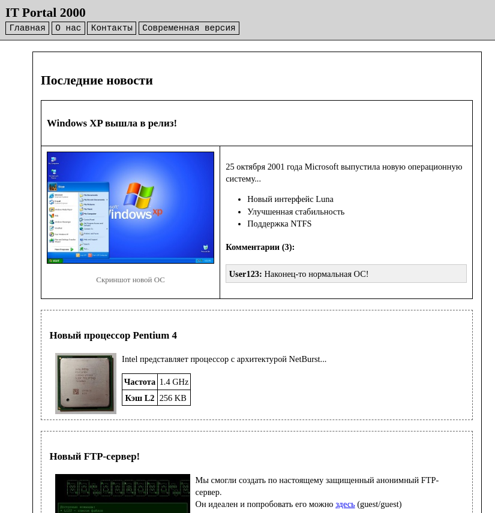

Заходим на FTP с выданными кредами, где нас встречает readme и танцующий баннер. Так как там почти ничего нет, для нас интересным является readme, в котором дан "совет дня".

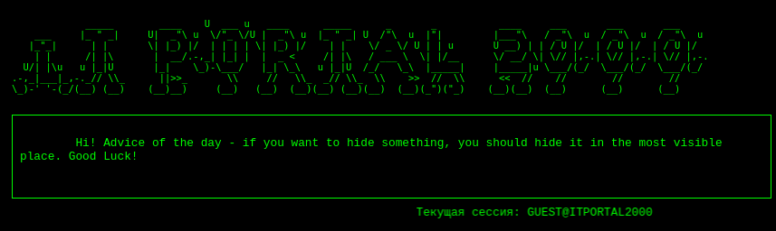

Первая же мысль - что где спрятан пароль. Вполне возможно, что от админки. Ссылаясь на остроумие автора и полное отсутствие содержимого кроме баннера, пробуем логиниться в админа с паролем "ITPORTAL2000". 

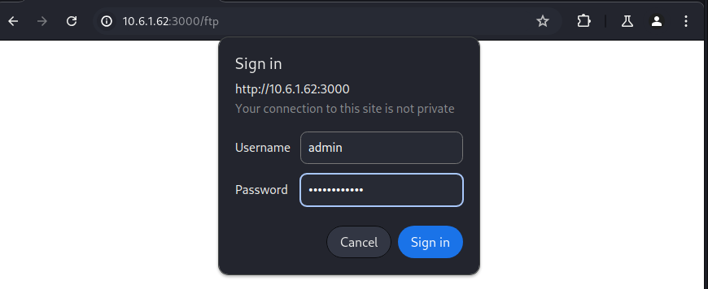

В конце концов - видим заветный флаг.

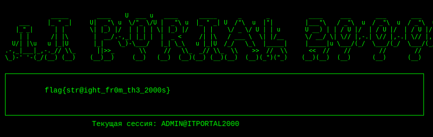